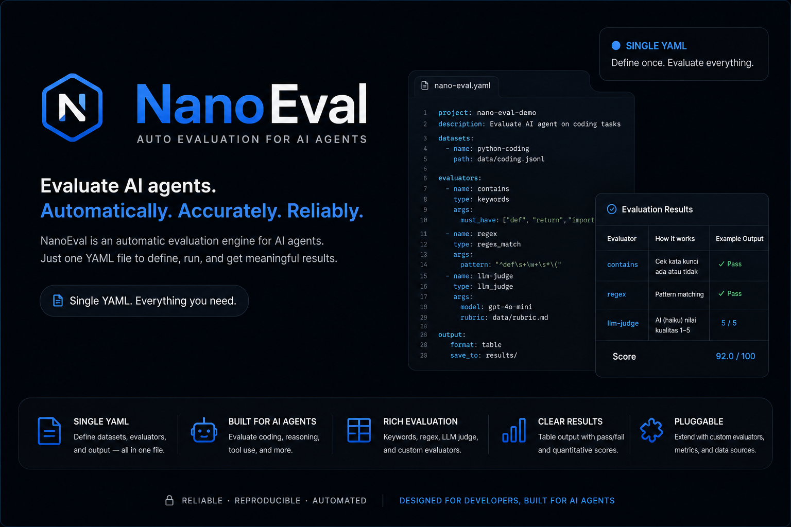

<div align="center">



<br/>

**Lightweight AI output evaluation framework — YAML test cases, LLM judge, zero server required.**

[](https://python.org)
[](LICENSE)
[]()
[]()
[]()

</div>

---

## The Problem

Testing AI outputs is painful. Existing tools (promptfoo, deepeval) require running a server, writing complex configs across multiple files, and assume Linux. There's no easy way to run a quick LLM-as-judge eval without setting up an entire infrastructure.

**NANO-EVAL FIXES ALL OF IT!!.**

---

## What Makes It Different

| Problem with others | nano-eval solution |
|---|---|
| Requires server / Docker to run | **Zero server** — single Python process, runs anywhere |
| Complex multi-file config | **Single YAML** — all cases, model config, evaluators in one file |
| Windows support broken | **Windows-first** — tested on PowerShell, no POSIX assumptions |
| Locked to one LLM provider | **6 providers** — Anthropic, OpenAI, Groq, Gemini, Ollama (local), Mistral |
| No LLM-as-judge out of the box | **Built-in LLM judge** — any provider scores 1-5, configurable criteria |
| Sequential test execution | **Concurrent by default** — `ThreadPoolExecutor`, configurable parallelism |
| No cost visibility | **Token tracking** — per-case and total token counts in every report |
| Hard to script / CI | **JSON report output** — `--output report.json`, exit code 1 on failure |

---

## Quick Start

```bash
# Install
pip install git+https://github.com/ghanibot/nano-eval.git

# Install with OpenAI support
pip install "git+https://github.com/ghanibot/nano-eval.git#egg=nano-eval[openai]"

# Run evals
nano-eval run configs/example.yaml

# Save report
nano-eval run configs/example.yaml --output report.json

# Show saved report
nano-eval show report.json

# Run only cases tagged "fast"
nano-eval run configs/example.yaml --tag fast
```

---

## YAML Config

```yaml
# eval.yaml
name: "my-eval"

model:
  provider: anthropic              # or: openai
  model: "claude-haiku-4-5-20251001"
  max_tokens: 512
  temperature: 0.0

judge:
  provider: anthropic
  model: "claude-haiku-4-5-20251001"   # cheap judge model

max_concurrency: 3      # parallel test execution
fail_fast: false        # stop on first failure

cases:
  - id: python-function
    description: "Model writes valid Python"
    input: "Write a function that returns fibonacci up to n"
    expected: "def "
    evaluator: contains             # shorthand — uses expected as value

  - id: explain-rest
    description: "Model explains REST clearly"
    input: "Explain REST API in 2 sentences"
    evaluator: llm-judge
    min_score: 4                    # 1-5 scale, must score >= 4 to pass
    criteria: "accuracy and clarity for beginners"

  - id: exact-greeting
    description: "Model outputs exact phrase"
    input: "Say exactly: Hello World"
    expected: "Hello World"
    evaluator: exact

  - id: valid-email
    description: "Output contains email pattern"
    input: "Generate a sample email address"
    evaluator:
      type: regex
      value: '[a-zA-Z0-9._%+-]+@[a-zA-Z0-9.-]+\.[a-zA-Z]{2,}'

  - id: slow-test
    tags: [slow]
    skip: false
    input: "..."
    evaluator: contains
    expected: "..."
```

---

## Evaluator Types

| Type | How it works | Pass condition |
|---|---|---|
| `contains` | Checks if `expected` substring is in output | Substring found |
| `regex` | `re.search(value, output)` | Pattern matches |
| `exact` | Strip + compare output to `expected` | Exact equality |
| `llm-judge` | Claude-haiku scores output 1-5 on `criteria` | `score >= min_score` |

### Shorthand vs Inline Config

```yaml
# Shorthand — uses evaluator name + expected field
evaluator: contains
expected: "def "

# Inline — full control
evaluator:
  type: regex
  value: 'def \w+\(.*\):'
  case_sensitive: false

# LLM judge
evaluator: llm-judge
min_score: 4
criteria: "technical accuracy and completeness"
```

---

## CLI Output

```
Running eval: my-eval  (4 cases, model: claude-haiku-4-5-20251001)
━━━━━━━━━━━━━━━━━━━━━━━━━━━━━━━━━━━━━━━━━━━━

  ✓  python-function      contains     1.00   312ms  'def ' found in output
  ✓  explain-rest         llm-judge    0.80   891ms  score 4/5: Clear and accurate for beginners
  ✓  exact-greeting       exact        1.00   244ms  exact match
  ✗  valid-email          regex        0.00   198ms  pattern not found in output

Results: 3/4 passed (75%)  avg score: 0.70  tokens: 1,204  time: 2.1s
```

---

## Python API

```python
from nano_eval.config import load_config
from nano_eval.core.runner import EvalRunner

cfg = load_config("eval.yaml")
report = EvalRunner(cfg).run()

print(f"{report.passed}/{report.total} passed ({report.pass_rate:.0%})")
print(f"Avg score: {report.avg_score:.2f}")
print(f"Total tokens: {report.total_tokens:,}")

for case in report.cases:
    status = "PASS" if case.passed else "FAIL"
    print(f"[{status}] {case.case_id}: {case.reason}")

# Save report
import json
with open("report.json", "w") as f:
    json.dump(report.to_dict(), f, indent=2)
```

---

## Report Schema

```json
{
  "name": "my-eval",
  "model": "claude-haiku-4-5-20251001",
  "total": 4,
  "passed": 3,
  "failed": 1,
  "skipped": 0,
  "pass_rate": 0.75,
  "avg_score": 0.70,
  "total_tokens": 1204,
  "duration_ms": 2143,
  "created_at": "2026-05-11T10:23:45",
  "cases": [
    {
      "case_id": "python-function",
      "description": "Model writes valid Python",
      "input": "Write a function...",
      "output": "def fibonacci(n):...",
      "passed": true,
      "score": 1.0,
      "reason": "'def ' found in output",
      "tokens_used": 287,
      "duration_ms": 312,
      "error": "",
      "tags": []
    }
  ]
}
```

---

## Architecture

```
EvalConfig (YAML)
       │
       ▼
  EvalRunner
  ├── ThreadPoolExecutor     — concurrent case execution, configurable max_workers
  ├── ModelRunnerFactory     — config-driven: anthropic | openai
  │   ├── AnthropicRunner    — claude-haiku / sonnet / opus
  │   └── OpenAIRunner       — gpt-4o / gpt-4o-mini
  └── EvaluatorFactory       — resolves string shorthand → EvaluatorConfig
      ├── ContainsEvaluator  — substring check, case-insensitive by default
      ├── RegexEvaluator     — re.search with flags
      ├── ExactEvaluator     — strip + compare
      └── LLMJudgeEvaluator  — claude-haiku scores 1-5, parses SCORE: n\nREASON: ...
```

---

## Model Providers

| Provider | Models | Cost | Requires |
|---|---|---|---|
| `anthropic` | `claude-haiku-4-5-20251001`, `claude-sonnet-4-6`, `claude-opus-4-7` | Paid | `ANTHROPIC_API_KEY` |
| `openai` | `gpt-4o`, `gpt-4o-mini` | Paid | `OPENAI_API_KEY` + `pip install nano-eval[openai]` |
| `groq` | `llama-3.1-8b-instant`, `llama-3.1-70b-versatile`, `mixtral-8x7b-32768` | Free tier | `GROQ_API_KEY` + `pip install nano-eval[groq]` |
| `gemini` | `gemini-1.5-flash`, `gemini-1.5-pro`, `gemini-2.0-flash-exp` | Free tier | `GOOGLE_API_KEY` + `pip install nano-eval[gemini]` |
| `ollama` | `llama3.2`, `mistral`, `phi3`, `gemma2`, `deepseek-r1` | **Free, local** | [Ollama](https://ollama.com) running + `ollama pull <model>` |
| `mistral` | `mistral-small-latest`, `mistral-large-latest` | Paid | `MISTRAL_API_KEY` + `pip install nano-eval[mistral]` |

### Install by provider

```bash
pip install nano-eval[groq]     # Groq (llama/mixtral, fast free tier)
pip install nano-eval[gemini]   # Google Gemini
pip install nano-eval[mistral]  # Mistral AI
pip install nano-eval[all]      # All cloud providers
# Ollama: zero extra deps — just run Ollama locally
```

### Switch provider in YAML

```yaml
model:
  provider: groq                      # change this line
  model: "llama-3.1-8b-instant"

judge:
  provider: groq                      # judge can use different provider
  model: "llama-3.1-70b-versatile"
```

---

## CI Integration

```yaml
# .github/workflows/eval.yml
- name: Run evals
  run: |
    pip install git+https://github.com/ghanibot/nano-eval.git
    nano-eval run configs/eval.yaml --output report.json
  env:
    ANTHROPIC_API_KEY: ${{ secrets.ANTHROPIC_API_KEY }}

- name: Upload report
  uses: actions/upload-artifact@v4
  with:
    name: eval-report
    path: report.json
```

Exit code is `1` when any case fails — CI catches it automatically.

---

## Integration with nano-orchestrator

nano-eval pairs with [nano-orchestrator](https://github.com/ghanibot/nano-orchestrator). Run evals as a stage in a multi-agent pipeline:

```python
# pipeline.yaml
agents:
  - id: generator
    type: claude-code
    task: "Generate code for feature X → output.py"

  - id: evaluator
    type: shell
    task: "nano-eval run eval.yaml --output report.json"
    depends_on:
      - agent: generator
        reached_state: done
```

---

## CLI Reference

```bash
nano-eval run  <config.yaml>                        # Run all cases
nano-eval run  <config.yaml> --output report.json   # Save JSON report
nano-eval run  <config.yaml> --fail-fast            # Stop on first failure
nano-eval run  <config.yaml> --tag <tag>            # Filter by tag
nano-eval show <report.json>                        # Display saved report
```

---

## Contributing

```bash
git clone https://github.com/ghanibot/nano-eval
cd nano-eval
pip install -e ".[dev]"
pytest
```

---

## License

MIT — see [LICENSE](LICENSE)
